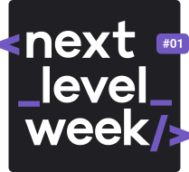
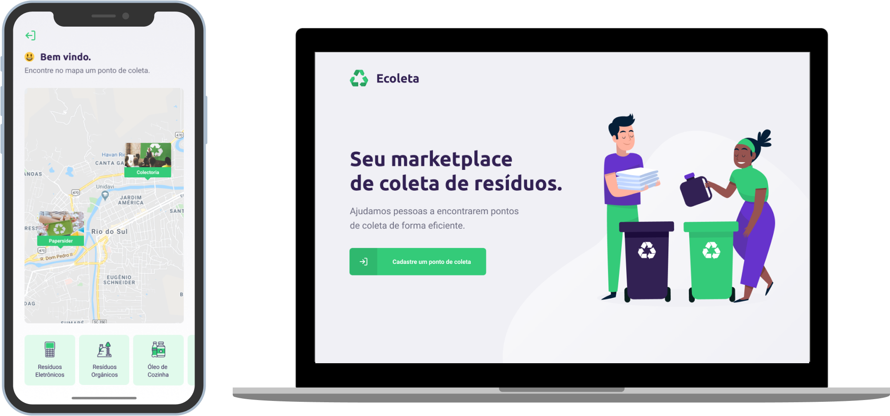

<h1 align="center">
 
 </h1>

<h2 align="center">
   


</h2>

<h4 align="center"> 
	:heavy_check_mark:  NextLevelWeek 1.0 🚀 Done! :heavy_check_mark:
</h4>
<p align="center">

  <a href="https://www.linkedin.com/in/mrlucasrib/">
    
  </a>

[](https://app.codacy.com/gh/mrlucasrib/Ecoleta-NLW?utm_source=github.com&utm_medium=referral&utm_content=mrlucasrib/Ecoleta-NLW&utm_campaign=Badge_Grade)		
  <a aria-label="Completed" href="https://nextlevelweek.com/">
    </img>
  </a>
  
   <a href="https://github.com/DanielObara/NLW-1.0/stargazers">
    
  </a>
</p>
<p align="center">
  <a href="#-nlw">Next Level Week</a>&nbsp;&nbsp;&nbsp;|&nbsp;&nbsp;&nbsp;
  <a href="#-project">Project</a>&nbsp;&nbsp;&nbsp;|&nbsp;&nbsp;&nbsp;
  <a href="#rocket-Technologies">Technologies</a>&nbsp;&nbsp;&nbsp;|&nbsp;&nbsp;&nbsp;
  <a href="#-layout">Layout</a>&nbsp;&nbsp;&nbsp;|&nbsp;&nbsp;&nbsp;
  <a href="#information_source-how-to-use">How to use</a>&nbsp;&nbsp;&nbsp;|&nbsp;&nbsp;&nbsp;
  <a href="#-how-to-contribute">How to contribute</a>&nbsp;&nbsp;&nbsp;|&nbsp;&nbsp;&nbsp;
  <a href="#memo-license">License</a>
</p>

## :information_source: What's Next Level Week?

NLW is a practical week with lots of code, challenges, networking and a single objective: to take you to the next level.
Through our method you will learn new tools, learn about new technologies and discover hacks that will boost your career.
An online and completely free event that will help you take the next step in your evolution as a dev.

## 💻 Project



Ecoleta is a project developed based on international environment week. 
That aims to connect people to companies that collect specific waste such as light bulbs, batteries, cooking oil, etc.

## :rocket: Technologies

This project was developed with the following technologies:

- [Node.js][nodejs]
- [TypeScript][typescript]
- [React][reactjs]
- [React Native][rn]
- [Expo][expo]

## 🔖 Layout

To access the layout use [Figma](https://www.figma.com/file/9TlOcj6l7D05fZhU12xWT3/Ecoleta-(Booster)?node-id=0%3A1).

## :information_source: How To Use

To clone and run this application, you'll need [Git](https://git-scm.com), [Node.js][nodejs] + [Yarn][yarn] installed on your computer.

From your command line:

### Install API 

```bash
# Clone this repository
$ git clone https://github.com/mrlucasrib/Ecoleta-NLW.git

# Go into the repository
$ cd Ecoleta-NLW/server

# Install dependencies
$ yarn install

# Run Migrates
$ yarn knex:migrate

# Run Seeds
$ yarn knex:seed

# Start server
$ yarn dev

# running on port 3333
```

### Install Front-end

```bash
# Clone this repository
$ git clone https://github.com/mrlucasrib/Ecoleta-NLW.git

# Go into the repository
$ cd Ecoleta-NLW/web

# Install dependencies
$ yarn install

# Run
$ yarn start

# running on port 3000
```

### Install Mobile

```bash
# Clone this repository
$ git clone https://github.com/mrlucasrib/Ecoleta-NLW.git
# Go into the repository
$ cd Ecoleta-NLW/mobile

# Install dependencies
$ yarn install

# Run
$ yarn start

# Expo will open, just scan the qrcode on terminal or expo page

# If some problem with fonts, execute:
$ expo install expo-font @expo-google-fonts/ubuntu @expo-google-fonts/roboto

```

## 🤔 How to contribute

-  Make a fork;
-  Create a branch with your feature: `git checkout -b my-feature`;
-  Commit changes: `git commit -m 'feat: My new feature'`;
-  Make a push to your branch: `git push origin my-feature`.

After merging your receipt request to done, you can delete a branch from yours.

## :memo: License

This project is under the MIT license. See the [LICENSE](https://github.com/mrlucasrib/Ecoleta-NLW/blob/master/LICENSE) for details.

Made with ♥ by Lucas Ribeiro :wave: [Get in touch!](https://www.linkedin.com/in/mrlucasrib/)

[nodejs]: https://nodejs.org/
[typescript]: https://www.typescriptlang.org/
[expo]: https://expo.io/
[reactjs]: https://reactjs.org
[rn]: https://facebook.github.io/react-native/
[yarn]: https://yarnpkg.com/